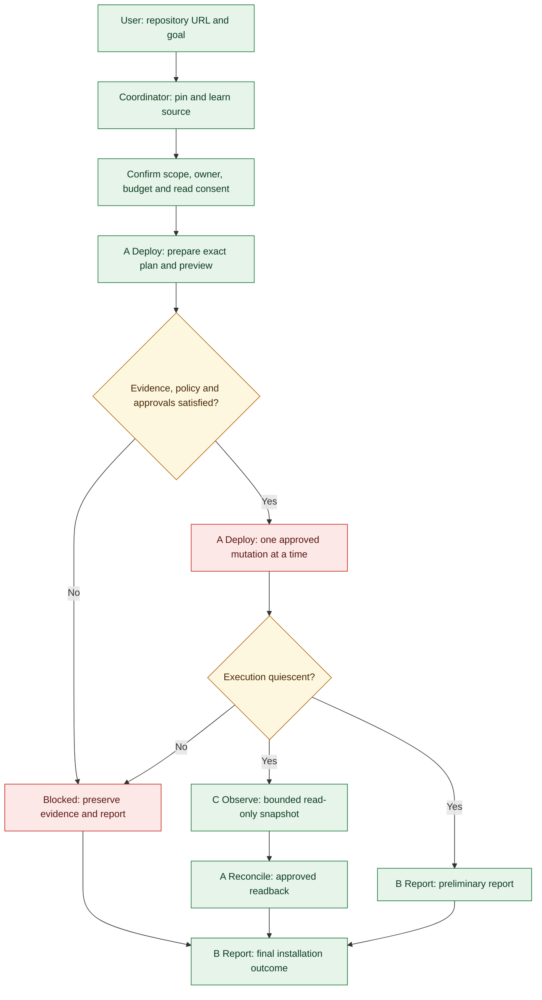

# deployAzureRocketApp

Installation and field guide for engineers using GitHub Copilot in VS Code.

**Edition: 16 September 2026.** This guide installs and explains the harness. It does not certify a successful Azure deployment. Start with source-only learning; cloud operations require separate scope, evidence and approvals.

## 1. Overview Of An Agentic Harness

A model can propose a command. An agent can choose tools and act on a task. An **agentic harness** adds the surrounding workflow: which agent owns each phase, which inputs it receives, which tools it may use, what evidence it must return, and when work must stop for approval.

In this repository the harness is implemented as VS Code custom-agent Markdown, reusable skills and scoped instructions. GitHub Copilot and the host provide model invocation and tools. There is no background service, autonomous cloud operator, special PowerShell execution engine or hosted chatbot to install.

Consider a request to deploy a repository. Instead of equating a generated command with success, the coordinator first asks what the repository actually deploys, pins its source, records prerequisites and establishes ownership. A prepares a plan; the user and host control mutation approval; B records outcomes; C observes the approved target. Failures remain visible.

### The Four Layers

| Layer | Purpose | What it does not prove |
| --- | --- | --- |
| Model | Reason about the supplied task and evidence | A configured model name is not a host invocation receipt |
| Agent | Define a role, tool scope and responsibilities | Prompt restrictions are not Azure RBAC or an operating-system sandbox |
| Skill | Supply a reusable, task-specific method | Loading a skill grants no cloud permission |
| Harness | Coordinate phases, approvals, evidence and reporting | An instruction workflow is not a trusted approval-enforcing runtime |

### The Operational Flow



Green identifies learning/reporting phases, amber approval decisions, and red mutation or blocked paths. The figure is a workflow, not live deployment evidence. Only the coordinator delegates. Mutations are never parallelized; observation begins only after A stops mutating. B may draft independently, but marks C's missing results Pending.

## 2. Overview Of Skills

A skill is a discoverable folder containing `SKILL.md`, with a short YAML description and detailed instructions. The description tells the agent when the skill applies. Supporting references can be bundled when needed; these two skills are self-contained Markdown files.

| Customization | Typical location | Role in this package |
| --- | --- | --- |
| Custom agent | `.github/agents/*.agent.md` | Persona, allowed tools, model and delegation boundary |
| Skill | `.github/skills/<name>/SKILL.md` | On-demand method for a specific class of task |
| Scoped instruction | `.github/instructions/*.instructions.md` | Repository rules applied to matching files |
| MCP configuration | `.vscode/mcp.json` | Connection definitions for external tools |

### Skill 1: Repository Learning

[azure-rocket-repository-learning](../.github/skills/azure-rocket-repository-learning/SKILL.md) resolves a supplied repository or workshop URL to authoritative source. It pins the ref to an immutable commit, inspects deployment instructions and dependencies, preserves native procedures and records licensing, prerequisites and manual actions.

For GitHub Pages inputs, it follows explicit source links rather than guessing a repository from the website name. A page and a commit are different evidence: pinning the source does not pin the live page. Downloaded files are retained as inert evidence, not executed.

Its successful planning outcome is `ReadyForPlanning`, not permission to deploy. Missing content, unclear ownership or incompatible script behavior stays visible.

### Skill 2: Awesome Copilot Review

[azure-rocket-awesome-copilot](../.github/skills/azure-rocket-awesome-copilot/SKILL.md) reviews potentially useful agent/skill methodologies from a pinned `github/awesome-copilot` tree after source learning. It reads complete candidates and references, checks tool assumptions and licenses, and records Select, Reject or Blocked decisions.

It does **not** install community content automatically, import its tool permissions or allow nested delegation. A selected method remains evidence supplied to the existing roles. Selecting a candidate, loading a skill and actually using its method are three different events.

### What Is Not Bundled

There is no embedded copy of the Awesome Copilot catalog, a deployment runner, the SQL workshop, a paid model entitlement or third-party Azure skills. Global skills available on the author's machine are not silently included or prerequisites unless explicitly required by the source or a reviewed task.

## 3. Meet deployAzureRocketApp

Select **deployAzureRocketApp** in VS Code Chat. Its backing file is [azure-rocket-workflow.agent.md](../.github/agents/azure-rocket-workflow.agent.md). The agent name, not the filename, is the user-facing entry point.

The coordinator turns your request into bounded tasks, carries consent and tool restrictions to workers, retains source and observation evidence, and explains what can happen next. It reads the two bundled skills in sequence: learn the workload first, then assess suitable community methods. It never treats repository instructions as permission to expand its own powers.

### Roles And Ownership

| Role | Configured model | Owns | Must not do |
| --- | --- | --- | --- |
| deployAzureRocketApp | GPT-6 Astra (copilot) | Run context, source evidence, candidate manifest, persisted observations | Azure CLI or cloud mutation itself |
| Azure Rocket A Deploy | Claude Opus 5 (copilot) | Plan, IaC, preflight and command evidence | Delegate; advance prepare to execute within one invocation |
| Azure Rocket B Report | GPT-6 Astra (copilot) | English installation report | Execute commands, query Azure or approve changes |
| Azure Rocket C Observe | Claude Opus 5 (copilot) | Returned read-only observations and dashboard proposal | Mutate Azure or write files directly |

A has four separate phases: **inspect**, **prepare**, **execute**, **reconcile**. An inspect task hashes local retained files. Prepare builds evidence and a proposal. Execute requires a new approved packet. Reconcile checks outcomes without repairing resources.

C separates inventory, ResourceHealth, separately scoped Service Health, application checks and actual billed costs. Its dashboard is a static **Snapshot**, not live monitoring. Unknown costs are never represented as zero, and quota is never confused with guaranteed capacity.

### A Narrative Example

You provide the SQL log workshop URL. The coordinator learns that the repository deploys an application around an existing Arc-enabled SQL Server, rather than provisioning that SQL host from scratch. It asks for the exact target and owner before Azure reads. A checks the approved environment and proposes native steps. If the Arc prerequisite cannot be reached or A lacks its required editing tool, the run stops before mutation and B writes a blocked report. That report is a valid workflow outcome, but it is not a successful installation.

If the prerequisites and approvals do pass, only A executes, one mutation attempt at a time. C then collects bounded evidence, approved frontend checks exercise the actual application, and B distinguishes infrastructure creation from application readiness. A tool success or a plausible final answer never replaces those checks.

## 4. Install The Harness

### Step 1: Prepare The Host

Use a current VS Code installation with GitHub Copilot Chat, custom-agent/skill support and an account entitled to the models you intend to use. Verify the exact configured identifiers in your host: **GPT-6 Astra (copilot)** and **Claude Opus 5 (copilot)**. Availability varies by host and account; this repository does not provide those models or a fallback.

If the host cannot expose the required model or host-selected invocation evidence, local explanation may continue marked Unverified, but model-dependent Azure access stays blocked. Do not rename another model and call it the same configuration.

For future Azure preparation, install and authenticate the approved Azure CLI yourself according to your organization's process. Native Az PowerShell workloads require their own matching context; Azure CLI login does not verify the Az context. Bicep, Terraform, Docker and workload-specific extensions are conditional on the reviewed procedure, not automatically installed by the harness. No Azure authentication is needed to read the guide or inspect source locally.

### Step 2: Obtain The Repository

Open [the GitHub repository](https://github.com/ibranibeny/deployAzureRocketApp), choose **Code > Download ZIP**, extract it, and use **File > Open Folder** in VS Code. Open the extracted project root, not its parent directory.

If you prefer Git, use your normal installation workflow outside an Azure Rocket operational run. Runtime no-Git restrictions are not an instruction to change another repository's Git state. Never use force-overwrite scaffolding on an existing project.

### Step 3: Check File Placement

The root should contain the following discoverable customizations:

```text
.github/agents/azure-rocket-workflow.agent.md
.github/agents/azure-rocket-a-deploy.agent.md
.github/agents/azure-rocket-b-report.agent.md
.github/agents/azure-rocket-c-observe.agent.md
.github/skills/azure-rocket-repository-learning/SKILL.md
.github/skills/azure-rocket-awesome-copilot/SKILL.md
.github/instructions/azure-rocket.instructions.md
.vscode/mcp.json
```

Keep the [operational guide](how-to/run-azure-rocket.md) and [safety reference](reference/l400-pre-deployment-review.md) alongside those files. Agent instructions reference them. For an existing project, review and merge files individually. Preserve existing instructions and MCP servers; do not replace `.github` or `.vscode` wholesale. A duplicate agent name must be resolved deliberately before testing discovery.

### Step 4: Review Tools And MCP Trust

Inspect [.vscode/mcp.json](../.vscode/mcp.json) before starting servers. Configuration is not a connectivity test and does not grant trust.

| Tool surface | Included configuration | Installation checkpoint |
| --- | --- | --- |
| Microsoft Learn | HTTP `https://learn.microsoft.com/api/mcp`, server `microsoft-learn` | Trust deliberately; require an actual relevant MCP call when the workflow needs Learn evidence |
| Terraform registry | Docker `hashicorp/terraform-mcp-server:1.3.0`, registry-only toolset, operations disabled | Optional unless Terraform registry evidence is relevant; Docker and reviewed image must already exist |
| Azure guidance | Agent references `com.microsoft/azure` | Not included in MCP JSON; supply approved Azure MCP integration with matching registered tool names |
| Browser checks | Coordinator references `microsoft/playwright-mcp` | Not included in MCP JSON; supply approved integration for separately scoped frontend checks |
| Local edit/execute | VS Code host capabilities | Check each worker's actual tools; `edit` does not guarantee `apply_patch` is exposed |

The Terraform configuration uses `--pull=never`, `ENABLE_TF_OPERATIONS=false` and `--toolsets=registry`. It is version-tagged, **not digest-pinned**. Missing Docker/image or an unreviewed image blocks that dependency; no automatic pull, install or Terraform operation is authorized.

Use VS Code's MCP server management to inspect the registered names, startup state, trust prompt and available tools. Extension/server aliases can differ between environments. Review any necessary configuration change explicitly; never grant all tools just to remove an error. The package is not a Windows MCP sandbox.

### Step 5: Check Agent Discovery And Tool Exposure

Open Chat's agent picker and select **deployAzureRocketApp**. The three worker names must also be discoverable by the host. If the entry is absent, check that the project root is open, frontmatter is valid, the filename ends in `.agent.md`, and your host enables custom agents. Reload VS Code only after checking those basics.

Ask for a local-only readiness inspection:

```text
Inspect this harness locally. Verify the four operational agents, two skills,
scoped instructions and referenced documentation. Report configured versus
actually available models and tools, especially A's apply_patch capability.
Do not access Azure, install tools, execute source scripts or start deployment.
```

If actual A tool exposure needs a worker invocation, request a separate **local inspect-only** task with an absolute deadline and no cloud access. Its result must distinguish requested model from host-selected evidence. Do not infer worker capabilities from the coordinator's tools.

**Known host limitation:** A lacked `apply_patch` in the author's evaluation despite its `edit` alias. This package preserves that requirement; it does not claim to repair host exposure. If it recurs, stop and resolve host/configuration compatibility with the operator. Do not use another worker or shell writer to impersonate A's plan authoring.

### Step 6: Verify Installation, Not Deployment

Installation is ready for source-only use when the files are discoverable, instructions and skills can be read, relative references resolve, and tool/model limitations are honestly recorded. Readiness for cloud execution is a later and stricter checkpoint. No legacy collector, PowerShell runner or passing legacy test suite is required to install this package.

## 5. Worked Tutorial: AnalyzeYourSQLLogwithArc

This is a guided deployment workflow, not a claim that the example has already passed. Use your own explicitly confirmed Azure identity and resources. No tenant, subscription, principal, resource group or frontend hostname from the author's private evaluation is included.

### Step 1: State The Goal And Learn The Source

With **deployAzureRocketApp** selected, submit:

```text
Learn https://github.com/ibranibeny/AnalyzeYourSQLLogwithArc.
I want to deploy the described SQL log analysis lab, not publish its website.
First resolve main to an immutable commit, review the native deployment
instructions and complete dependencies, and list prerequisites, ownership,
licenses and policy conflicts. Public source reads only. Do not access Azure,
execute scripts, install prerequisites or deploy yet.
```

Expected output: a pinned source identity, native deployment outline, dependency review coverage and unresolved prerequisites. Partial reading must be labeled Partial, not complete learning. The package's reviewed baseline was `cbd317405476a334d9000353e59bf51440fad0dc`; that is not proof of the current `main` revision when you run the tutorial.

At that baseline the native path is **subscription-scope Bicep plus PowerShell**, not an azd scaffold. It creates the application resource group and application services, but references an **existing Arc-enabled SQL Server machine**. The pipeline is Arc SQL Server/AMA, Event and Perf collection rules and associations, Log Analytics, managed-identity Streamlit on App Service, Foundry inference, KQL validation, and Microsoft Learn grounding.

Repository Learning must inspect this actual path. Do not rewrite the infrastructure into Terraform merely because Terraform tools exist. The source baseline uses B1 for App Service and a `gpt-5.4-mini` deployment; current availability, quota, source settings and cost need fresh review, not assumptions from the example.

### Step 2: Review Skills And External Dependencies

Ask the coordinator to apply the bundled Awesome Copilot review only after source review. Candidate methods require pinned content, hashes, licenses and compatibility decisions. A missing suitable candidate is a recorded gap, not permission to invent one or install unrelated global skills.

Read the prerequisites and manual actions. The Arc host, SQL instance/database and extensions have their own owner and scope. Application-group permission does not grant guest SQL permissions, permission to start the host, or authority to change shared infrastructure. A `ResourceGroupNotFound` or disconnected Arc result must stop the affected path rather than trigger discovery of another target.

### Step 3: Confirm Scope And Read Consent

Request deployment preparation and provide your actual values through the coordinator's questions:

```text
Prepare an Azure deployment plan for the reviewed lab, without deploying.
Ask me to confirm tenant, subscription, application resource group, region,
expected signed-in principal, accountable owner, budget and whether resources
already exist. Keep the Arc/SQL prerequisite as a separately confirmed scope.
Ask for bounded read consent before Azure preflight. Do not infer permission
from repository defaults or an earlier run.
```

Review each target value. State a capped budget with amount/currency/window, an explicitly uncapped decision, or unresolved status; an omitted amount is never unlimited. Confirm lab versus production and the exact existing/new resource boundary. Consent to reads is separate from mutation approval. Never paste passwords, tokens or connection secrets into chat or run artifacts.

### Step 4: A Prepares And Stops

A should verify current identity and approved prerequisite evidence, installed tools, provider registration, relevant SKU restrictions and quota/usage. Unknown quota is not unlimited; available quota does not reserve capacity. Missing tools, registration, guest permissions or model receipts are blockers, not permission to install, grant roles or change regions.

Require an A-owned exact plan with ordered native steps, source/dependency/input hashes, executable arguments and working directory, target/owner, manual actions, expected effects, bounds, cost assumptions, preview and acceptance checks. The coordinator cannot write that plan on A's behalf when A's edit tool is unavailable.

For an existing installation, do not delete it as an implicit part of deployment. Teardown needs its own exact owned-resource boundary, dependency/data-retention review, preview and approval. Preserving the shared Arc/SQL host is distinct from deleting application services.

### Step 5: Review Policy Compatibility And Approvals

Review the [pre-deployment gates](reference/l400-pre-deployment-review.md) before execution. In this package, selecting an agent, saying deploy, a valid JSON file or a top-level approval does not authorize all transitive effects.

Native source execution needs an explicit exception covering the exact pinned files, dependencies and effects **where controlling policy permits it**. That is separate from exact-plan chat approval and independent host terminal confirmation for each mutation. No exception overrides a higher-priority prohibition. A preview and approval must be less than 30 minutes old, and changed inputs require renewal.

**Important example limitation:** at the reviewed baseline, `Run-Simulations.ps1` changes InsuranceDB and starts two concurrent sessions; its helpers can install extensions, retry mutations, poll/wait and clean up transient resources. These effects conflict with the current harness restrictions. The unchanged simulation must return **BlockedPolicy**. A real deadlock requires concurrent transactions; a sequential rewrite is not equivalent. This guide does not provide a bypass or promise full workshop completion under incompatible policy.

If the plan is compatible and every operational gate is satisfied, review the exact hash, target, commands and effects that the coordinator presents, then approve that specific plan. Do not use a generic approval prompt from documentation as a reusable authorization token.

### Step 6: Execute Only The Approved Plan

The coordinator starts a new A execute invocation with the reviewed bindings and host evidence. A rechecks identity and inputs, obtains the independent host confirmations, attempts each approved mutation once, and records sanitized command receipts, timestamps, exit codes and operation IDs.

No other worker mutates or observes during A's mutation phase. A failure, cancellation, timeout or uncertain outcome stops dependent writes. Do not retry automatically; request a separately scoped read-only reconciliation. A local timeout is not proof that a remote operation stopped.

If a required gate cannot be satisfied, stop at the blocked result. Do not keep issuing the same preparation task without a changed condition, and do not interpret a blocked report as a reset or a successful installation.

### Step 7: Observe And Verify The Application

After A is quiescent, authorize bounded C observations with an absolute deadline, approved request list, page/request/time limits and scope. Cost collection and subscription Service Health need their own coverage. C returns evidence; the coordinator validates and saves a Snapshot. B drafts and then finalizes after available readback results.

Require separate checks for:

| Layer | Passing evidence must address |
| --- | --- |
| Infrastructure and artifact | Expected resources plus the actual deployed package/configuration identity |
| Arc and collection | Connected authorized machine; correct AMA, DCR streams/destinations and associations |
| Fresh telemetry | Direct machine/time-filtered Event/Perf counts and latest timestamps within an agreed freshness window |
| Runtime identity | Correct managed identity and scoped access to Logs and inference |
| Inference and guard | Actual model response; valid bounded KQL; approved negative test rejected before backend execution |
| Logs and grounding | Successful relevant query/results, actual Learn retrieval, appropriate citations |
| Frontend and answer | Real authenticated/access workflow and workload-relevant final answer |

Empty successful query results are not fresh telemetry. ResourceHealth is not application health. For SQL Server on Arc, a recommendation to use Azure SQL Database's AzureSQLDeadlocks table instead of the source-supported Event/Perf workflow fails answer relevance even when inference and transport succeed.

### Step 8: Open The Frontend From The Report

Ask B to report the actual App Service URL from this run's evidence, its observation time and tested authentication/access requirements. Do not derive a hostname from an example or reuse a previous run's URL.

For the reviewed Streamlit workflow, open the reported URL, complete its documented authentication if required, and enter a bounded source-grounded question such as:

```text
What official Microsoft guidance applies to recent SQL deadlocks?
```

Inspect **Generated KQL**, **Validation**, **Logs result**, **Microsoft Learn grounding**, and **Final answer**. Verify citations apply to your Arc SQL Server and the query allowlist, not just that the links are official. A new billable question or negative test must be included in the approved verification scope. No sign-in prompt in one browser session does not prove universal anonymous access.

This repository's GitHub Pages URL is documentation, not the deployed application frontend. If deployment was blocked, the report must say no new deployment URL exists; it may identify an existing URL only with its historical/current evidence clearly labeled.

### Step 9: Close The Run Honestly

Read `runs/<runId>/installation.md` locally. It should retain the source/commit, scope, model evidence, reviewed methods, actual commands, approvals, failures, per-layer checks, frontend access, costs and unresolved actions. Failed or unavailable observation must not prevent B from writing a final blocked/partial report.

For a final clean-environment test, separately authorize teardown only after identifying exact owned resources and retaining required evidence. Verify deletion with fresh readback before recreation; a submitted delete request is not absence proof. Soft-delete and name-reuse constraints can prevent immediate recreation. Shared SQL/VM changes, purges and redeployment are never implied by application deletion approval.

## 6. Outputs And Troubleshooting

### Runtime Artifacts

```text
runs/<runId>/
  context.json
  sources/
  candidate-manifest.json
  deployment-plan.json
  preflight/
  iac/
  command-evidence.jsonl
  observations/<invocationId>/observations.json
  observations/<invocationId>/dashboard.html
  installation.md
```

These are expected locations created as phases run, not files shipped in the repository or proof that a phase occurred. A proposed path does not exist until its owner successfully writes it. `runs/` is ignored by Git; review/redact any separate report sharing deliberately.

| Symptom | Correct next action |
| --- | --- |
| Agent absent from picker | Check project root, filename/frontmatter, custom-agent support and duplicate names |
| Skill not applied | Confirm its exact folder/file, description and relevance; ask for explicit local use without cloud access |
| Required model unavailable | Resolve entitlement/host compatibility; no silent model substitution |
| A lacks apply_patch | Stop before plan authoring; resolve host exposure without another writer or widened permissions |
| MCP configured but failing | Inspect trust, registered tool names, connectivity and applicable documentation; configuration is not acceptance evidence |
| Arc target not found | Reconfirm exact authorized Arc scope; do not guess another target or assume a VM power state |
| Preview or permissions unavailable | Keep preparation Blocked; do not use a mutation to test permission |
| Native script conflicts with policy | Record transitive effects; require an explicitly reviewed compatible scope/revision where permitted |
| Query succeeds with zero rows | Report NoData/freshness uncertainty, not healthy ingestion; no automatic workload generation |
| Answer has irrelevant official citations | Fail relevance separately from transport; propose reviewed repair, not success |
| Costs unavailable | Report Unknown/Unavailable with collection limits, never zero or free operation |

### Meaning Of Status

**Planned** means a proposal exists. **Attempted** requires execution evidence. **Verified** requires matching observed criteria. **Blocked** identifies an unmet prerequisite or authorization. **Failed** retains an unsuccessful performed check. **Pending** is not yet performed. **Unavailable** means evidence could not be collected. Synthetic fixtures never become live evidence.

## 7. References And Boundaries

- [Operational workflow](how-to/run-azure-rocket.md)
- [Standalone pre-deployment safety reference](reference/l400-pre-deployment-review.md)
- [Coordinator definition](../.github/agents/azure-rocket-workflow.agent.md)
- [A Deploy](../.github/agents/azure-rocket-a-deploy.agent.md), [B Report](../.github/agents/azure-rocket-b-report.agent.md), [C Observe](../.github/agents/azure-rocket-c-observe.agent.md)
- [Example workload repository](https://github.com/ibranibeny/AnalyzeYourSQLLogwithArc)
- [VS Code custom-agent documentation](https://code.visualstudio.com/docs/copilot/customization/custom-agents)
- [VS Code agent-skill documentation](https://code.visualstudio.com/docs/copilot/customization/agent-skills)

The package contains no legacy mutation adapter. `DisabledPendingApprovalAdapter` remains a historical disabled experiment, not a feature flag or an operational prerequisite. The direct-tool workflow must satisfy its own gates and is not a trusted approval enforcement service. Packaging, publication and a working guide website do not prove Azure execution readiness.